# Architecture

森 (*mori*) is a local CLI with a deliberately narrow pipeline:

```mermaid
flowchart LR
    A[Paths and options] --> B[Bounded discovery]
    B --> C[Language registry]
    C --> D[Native Tree-sitter parsers]
    D --> E[Comparison fragments]
    E --> F[Canonical feature bags]
    F --> G[Size-bound pruning]
    G --> H[Weighted Jaccard]
    H --> I[Deterministic text or JSON]
```

Each stage owns one kind of uncertainty. Discovery decides what can be read,
grammar adapters decide where comparison fragments begin and end,
normalization decides which syntax distinctions matter, and scoring reports
overlap without claiming behavioral equivalence.

## Package responsibilities

### `internal/source`

- Expands explicit files and directories.
- Detects supported extensions through the language registry.
- Reads only a bounded first line to recognize supported interpreters in
  extensionless scripts; it never executes an interpreter.
- Skips dependency, VCS, and build-output directories.
- Loads nested `.gitignore` and `.moriignore` rules for directory scans.
- Applies repeatable doublestar exclude globs.
- Applies selected comparison domains before file-size checks and parsing.
- Rejects discovered symlinks and symlinked components below trusted scan
  roots.
- Enforces a file-size limit before and during reads.
- Stops directory walking when the scan context is canceled.
- Returns recoverable warnings instead of hiding explicit-input failures.

Paths are sorted before parsing so worker scheduling cannot alter output.

### `internal/config`

Loads a strict, size-bounded `.mori.json` discovered upward from the current
working directory or selected with `--config`. Unknown fields and non-regular
files fail closed. Command-line flags override configured scalar values, while
repeatable exclusions and language pairs are additive.

### `internal/language`

The registry binds:

- a stable language ID, review family, comparison domain, and fragment kind;
- display name, extensions, and optional shebang interpreter names;
- one generated Tree-sitter grammar; and
- grammar node predicates that identify comparison units.

Grammar versions are pinned as a compatible ABI set. Swift's upstream project
publishes generated C sources as a workflow artifact, while the PostgreSQL
module publishes its generated parser through Git LFS and a release archive.
Mori vendors the minimum generated sources and required headers under
`internal/grammar/swift` and `internal/grammar/postgresql`. Those packages
record exact source commits, artifacts, licenses, ABIs, and SHA-256 digests;
ordinary builds never download or regenerate them. A
table-driven test calls `Parser.SetLanguage` for every entry; compilation alone
does not detect grammar ABI mismatches.

### `internal/parser`

Each worker:

1. opens one regular file and verifies that its identity still matches
   discovery;
2. creates and closes its own Tree-sitter parser;
3. installs the selected grammar;
4. parses with cancellation support, applying bounded, byte-preserving
   adaptations for recognized valid JSX, SQLite, and SQLC forms, and closes the
   resulting tree;
5. walks nodes iteratively to find fragment boundaries; and
6. fingerprints valid fragments that meet `--min-tokens`.

Tree-sitter can recover from malformed source. A root containing errors creates
a structured warning with a bounded set of node ranges and the skipped-fragment
count, while any comparison fragment containing an error or nested below an
explicit error node is skipped.
Adaptations never change byte offsets: normalization and report locations still
refer to the original source. Nearby malformed forms remain parser errors.

Code languages extract function-like boundaries. Swift extracts implemented
functions, initializers, deinitializers, and closures; bodyless protocol
requirements, computed properties, accessors, and subscripts are not separate
comparison units. Generic SQL and explicitly selected PostgreSQL each extract
only top-level
`SELECT`/set-operation, `INSERT`, `UPDATE`, and `DELETE` statements. Exact,
immediately adjacent SQLC name comments label query locations. DDL is ignored,
and nested query structure remains inside its top-level query rather than
becoming another occurrence.

Nested functions are discovered independently. Their bodies are represented by
a single nested-function feature in the containing function, preventing a
large outer function from absorbing every feature in an inner callback.
Reports expose nesting depth, parent identity, and nested-function count so a
parent score is visibly an outer-body comparison.

### `internal/normalize`

Tree-sitter yields grammar-specific concrete syntax trees, not one universal
AST. The normalizer creates a shared representation within each comparison
domain with five feature classes:

1. canonical nodes;
2. coarse classes;
3. parent-child edges;
4. selected field roles; and
5. lightly weighted semantic operation families.

Names become placeholders, literals retain only their kind, and type-only
syntax is excluded. Unknown nodes remain as namespaced syntax features instead
of disappearing, preserving evidence while naturally reducing cross-language
overlap.

Operation families are intentionally small and curated. Bash/POSIX shell and
Zsh additionally share canonical word, variable-reference, and glob aliases
while retaining separate parsers. Swift maps its declarations, expressions,
arguments, identifiers, and control transfers into existing language-neutral
families. Generic SQL and PostgreSQL additionally map
query clauses, relational structure, and data-manipulation operations. All are
score hints, not semantic facts.

### `internal/analyzer`

Files parse concurrently with independent parsers. Results are collected by
input index and sorted by source location.

Fragments are then ordered by feature count. For a smaller bag \(A\) and larger
bag \(B\), weighted Jaccard cannot exceed:

\[
\frac{|A|}{|B|}
\]

Pairs whose upper bound is below the threshold are never scored. Fragments are
first partitioned by comparison domain, so SQL queries are never compared with
code functions. Same-language scans score within each review family, while
cross-language scans score across review families. TypeScript and TSX, and
Bash/POSIX shell and Zsh, therefore remain same-family comparisons. Explicit language-pair selectors expand
families into concrete grammar-ID pairs within one compatible domain without
enumerating unrelated combinations. The `--max-pairs` cap bounds the remaining
scored pairs and fails with an actionable error rather than returning an
incomplete report.

Qualifying location pairs are aggregated by their stable content-pair ID. The
default report retains the best 100 distinct groups and at most 20 locations
per fingerprint. Exact group and location-pair totals are maintained. Group
aggregation remains bounded by the candidate-pair safety limit;
`--max-groups 0` and `--max-occurrences 0` remove their respective output
limits, while `--max-pairs 0` removes the scored-pair safety limit.

Groups sort by score, shared evidence mass, represented location-pair count,
and stable identity. Shared shape and raw feature explanations are computed
after aggregation.

When focus is active, groups with at least one exact focused occurrence sort
before other groups, while the comparator within both buckets is unchanged.
Focus never restricts discovery or pair comparison and never changes scores,
fingerprints, or baseline identities. Exact focused totals are computed before
occurrence sampling and group retention.

When a baseline is supplied, accepted identities are filtered after scoring but
before group and location-pair accounting. This keeps suppressed candidates
from consuming the report budget and makes `--fail-on-match` a usable
regression gate. Baseline creation and pruning force complete group and
occurrence retention so the review file cannot omit identities past display
limits.

### `internal/baseline`

Baseline files are versioned JSON review artifacts. Schema 2 stores an explicit
`content` or `path` identity scope, stable content-pair IDs, the normalization
version, the writing Mori version, the scan threshold, and locations for human
context. Schema 1 remains readable as content scope. Loading fails closed on a
missing file, unsupported schema, or normalization-version mismatch. Writes
are sorted and atomic; pruning removes stale entries without accepting newly
discovered ones.

### `internal/vcs`

Git focus invokes the local `git` executable directly with context timeouts,
bounded NUL-delimited output, and no shell or network access. It resolves the
requested commit, HEAD, and merge base, then combines tracked working-tree
changes with untracked non-ignored paths. Renames use their destination;
deletions remain report evidence but cannot create focused occurrences.

### `internal/similarity`

The scorer computes multiset Jaccard using minimum counts for the intersection
and maximum counts for the union. It also returns the highest-count shared
features, sorted by count and feature name.

### `internal/report`

Text output is compact and review-oriented. JSON output has an explicit
`schema_version`; arrays are encoded as empty arrays rather than `null`.

Schema-7 reports expose deterministic binary provenance, comparison selection,
comparison domains, fragment kinds, optional exact focus metadata, grouped
content-pair identities, fragment fingerprints, occurrence samples and exact
counts, nesting metadata, structured parser
diagnostics, effective configuration, ignore sources, and separate baseline
suppression counts for identities and source-location pairs.

When focus is active, focused groups form the first bucket. Within each bucket,
and for every scan without focus, group ordering is:

1. descending score;
2. descending minimum feature count;
3. descending represented location-pair count; and
4. stable content-pair identity.

## Trust boundaries

森 treats source as untrusted input:

- source is read, never executed;
- parsers are native dependencies and therefore part of the trusted computing
  base;
- discovered symlinks and symlinked components below trusted scan roots are
  rejected;
- file size and pair counts are bounded;
- no network request or telemetry exists in the scan path; and
- JSON output contains paths, fragment names, scores, and normalized features,
  but never source bodies.

Filesystem metadata can change between checks. 森 verifies regular-file type and
file identity again after opening, but it does not claim protection against a
hostile process racing path replacement at every system-call boundary.

## Release architecture

Generated grammars and the Go binding use CGO. Cross-compiling from one host
would require several target C toolchains, so releases build on native GitHub
runners:

- Linux AMD64 and ARM64;
- macOS AMD64 and ARM64; and
- Windows AMD64.

Each runner tests, builds, and creates one deterministic archive. A final job
downloads the archives, writes SHA-256 checksums, creates or reuses a draft
release, uploads the complete asset set, and then publishes. This ordering is
compatible with GitHub immutable releases.
