# Architecture

森 (*mori*) is a local CLI with a deliberately narrow pipeline:

```mermaid
flowchart LR
    A[Paths and options] --> B[Bounded discovery]
    B --> C[Language registry]
    C --> D[Native Tree-sitter parsers]
    D --> E[Function fragments]
    E --> F[Canonical feature bags]
    F --> G[Size-bound pruning]
    G --> H[Weighted Jaccard]
    H --> I[Deterministic text or JSON]
```

Each stage owns one kind of uncertainty. Discovery decides what can be read,
grammar adapters decide where functions begin and end, normalization decides
which syntax distinctions matter, and scoring reports overlap without claiming
behavioral equivalence.

## Package responsibilities

### `internal/source`

- Expands explicit files and directories.
- Detects supported extensions through the language registry.
- Skips dependency, VCS, and build-output directories.
- Applies repeatable doublestar exclude globs.
- Rejects discovered symlinks and symlinked components below trusted scan
  roots.
- Enforces a file-size limit before and during reads.
- Stops directory walking when the scan context is canceled.
- Returns recoverable warnings instead of hiding explicit-input failures.

Paths are sorted before parsing so worker scheduling cannot alter output.

### `internal/language`

The registry binds:

- a stable language ID;
- display name and extensions;
- one generated Tree-sitter grammar; and
- grammar node kinds that represent function-like comparison units.

Grammar versions are pinned as a compatible ABI set. A table-driven test calls
`Parser.SetLanguage` for every entry; compilation alone does not detect grammar
ABI mismatches.

### `internal/parser`

Each worker:

1. opens one regular file and verifies that its identity still matches
   discovery;
2. creates and closes its own Tree-sitter parser;
3. installs the selected grammar;
4. parses with cancellation support and closes the resulting tree;
5. walks nodes iteratively to find function boundaries; and
6. fingerprints valid fragments that meet `--min-tokens`.

Tree-sitter can recover from malformed source. A root containing errors creates
a warning, while any function node containing an error is skipped.

Nested functions are discovered independently. Their bodies are represented by
a single nested-function feature in the containing function, preventing a
large outer function from absorbing every feature in an inner callback.

### `internal/normalize`

Tree-sitter yields grammar-specific concrete syntax trees, not one universal
AST. The normalizer creates a shared representation with five feature classes:

1. canonical nodes;
2. coarse classes;
3. parent-child edges;
4. selected field roles; and
5. lightly weighted semantic operation families.

Names become placeholders, literals retain only their kind, and type-only
syntax is excluded. Unknown nodes remain as namespaced syntax features instead
of disappearing, preserving evidence while naturally reducing cross-language
overlap.

Operation families are intentionally small and curated. They are score hints,
not semantic facts.

### `internal/analyzer`

Files parse concurrently with independent parsers. Results are collected by
input index and sorted by source location.

Fragments are then ordered by feature count. For a smaller bag \(A\) and larger
bag \(B\), weighted Jaccard cannot exceed:

\[
\frac{|A|}{|B|}
\]

Pairs whose upper bound is below the threshold are never scored. Cross-language
scans group fragments by language so same-language Cartesian products are not
enumerated. The `--max-pairs` cap bounds the remaining scored pairs and fails
with an actionable error rather than returning an incomplete report.

By default only the best 100 candidates are retained in a bounded heap while
the exact total match count is maintained. Shared-feature explanations are
computed after selection. `--max-matches 0` explicitly opts into unbounded
result retention.

### `internal/similarity`

The scorer computes multiset Jaccard using minimum counts for the intersection
and maximum counts for the union. It also returns the highest-count shared
features, sorted by count and feature name.

### `internal/report`

Text output is compact and review-oriented. JSON output has an explicit
`schema_version`; arrays are encoded as empty arrays rather than `null`.

Match ordering is:

1. descending score;
2. left source location; and
3. right source location.

## Trust boundaries

森 treats source as untrusted input:

- source is read, never executed;
- parsers are native dependencies and therefore part of the trusted computing
  base;
- discovered symlinks and symlinked components below trusted scan roots are
  rejected;
- file size and pair counts are bounded;
- no network request or telemetry exists in the scan path; and
- JSON output contains paths, function names, scores, and normalized features,
  but never source bodies.

Filesystem metadata can change between checks. 森 verifies regular-file type and
file identity again after opening, but it does not claim protection against a
hostile process racing path replacement at every system-call boundary.

## Release architecture

Generated grammars and the Go binding use CGO. Cross-compiling from one host
would require several target C toolchains, so releases build on native GitHub
runners:

- Linux AMD64 and ARM64;
- macOS AMD64 and ARM64; and
- Windows AMD64.

Each runner tests, builds, and creates one deterministic archive. A final job
downloads the archives, writes SHA-256 checksums, creates or reuses a draft
release, uploads the complete asset set, and then publishes. This ordering is
compatible with GitHub immutable releases.
